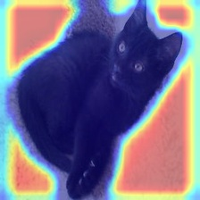

# Visual Explanations Using Grad-CAM: A Comprehensive Analysis and Quantitative Validation

[](https://www.python.org/downloads/)
[](https://pytorch.org/)
[](LICENSE)

Final project for **IF867 — Introduction to Deep Learning** at Universidade Federal de Pernambuco (UFPE).

This repository provides an engineering pipeline to benchmark the reliability of **Explainable AI (XAI)** methods on "black-box" Deep Learning image classifiers. It includes tools to visualize model decision-making, evaluate explanation quality through rigorous quantitative metrics, generate adversarial examples for robustness testing, and expose spurious correlations in biased models.

---

## Table of Contents

- [Features](#features)
- [Project Structure](#project-structure)
- [Installation](#installation)
- [Quick Start](#quick-start)
- [Usage](#usage)
  - [Explainable AI (XAI)](#explainable-ai-xai)
  - [XAI Metrics](#xai-metrics)
  - [Adversarial Attacks](#adversarial-attacks)
  - [Bias Detection](#bias-detection)
- [Supported Models](#supported-models)
- [Requirements](#requirements)
- [References](#references)

---

## Features

| Module | Description |
|--------|-------------|
| **Explainable AI (XAI)** | Implementations of Grad-CAM (Selvaraju et al., 2017), Guided Backpropagation, Guided Grad-CAM, and Counterfactual Grad-CAM for standard ImageNet classifiers. |
| **Quantitative Metrics** | Evaluation of explanation *Faithfulness* (Drop-in-Confidence) and *Sufficiency* (Insertion Score) on the ImageNetV2 dataset. |
| **Adversarial Robustness** | Stress-testing model explanations against Projected Gradient Descent (PGD) attacks to analyze failure modes under adversarial noise. |
| **Bias Detection** | Training pipelines for intentionally biased classifiers to visualize and expose learned spurious correlations using Grad-CAM. |

---

## Project Structure

```text
xai_project/
├── run_vgg16.py          # XAI pipeline for VGG16
├── run_resnet50.py       # XAI pipeline for ResNet50
├── run_googlenet.py      # XAI pipeline for GoogLeNet
├── imagenet_classes.py   # ImageNet class labels (1000 classes)
├── requirements.txt
│
├── utils/
│   ├── explainable_methods.py    # Runners for Grad-CAM, Guided Backprop, Guided Grad-CAM
│   ├── counterfactual_gradcam.py # Counterfactual Grad-CAM implementation
│   ├── classifier_output_targets.py
│   ├── xai_metrics.py            # Helpers for Drop-in-Confidence and Insertion Score
│   ├── calculate_metrics.py      # Metric computation on ImageNetV2
│   └── plot_metrics.py           # Visualization plotting for XAI metrics
│
├── metrics/              # XAI metric execution scripts per model
│   ├── vgg16.py
│   ├── resnet50.py
│   └── googlenet.py
│
├── adversarial/          # PGD attack implementation on ResNet50
│   ├── adversarial.py
│   ├── input_clean/          # Clean images for adversarial testing
│   ├── input_adversarial/    # Generated adversarial images
│   ├── results_clean/        # Heatmaps for clean images
│   └── results_adversarial/  # Heatmaps for adversarial images
│
├── biased_model/         # Bias detection pipeline
│   ├── model.py          # SimpleCNN architecture
│   ├── training.py       # Classifier training script
│   ├── identifying_bias.py
│   ├── pretrained_model.pth # Pretrained weigths for SimpleCNN
|   └── examples/         # Cat and dog pictures used to evaluate the biased model
│
├── input/                # Directory for clean input images (.jpg, .jpeg, .png)
└── outputs_*/            # Generated results (outputs_vgg16, outputs_resnet50, etc.)
```
---

## Installation

### 1. Clone the repository

```bash
git clone https://github.com/joaohl19/xai-project.git
cd xai-project
```

### 2. Create a virtual environment (recommended)

```bash
python -m venv venv
source venv/bin/activate   # On Windows: venv\Scripts\activate
```

### 3. Install dependencies

```bash
pip install -r requirements.txt
```

**Note:** The project uses `ImageNetV2_pytorch` from GitHub. If installation fails, ensure `git` is available and try:

```bash
pip install git+https://github.com/modestyachts/ImageNetV2_pytorch.git
```

---

## Quick Start

1. **Place images** in the `input/` and `adversarial/input_clean` folders (`.jpg`, `.jpeg`, or `.png`).

2. **Run XAI** for any supported model:

```bash
python run_vgg16.py
# or
python run_resnet50.py
# or
python run_googlenet.py
```

3. **Check results** in `outputs_vgg16/`, `outputs_resnet50/`, or `outputs_googlenet/`.

---

## Usage

### Explainable AI (XAI)

Generate saliency maps and explanations for ImageNet-pretrained models using **Grad-CAM** (Selvaraju et al., 2017) and related methods.

**Input:** Images in `input/`  
**Output:** Per-image visualizations in `outputs_<model>/`

| Method | Description |
|--------|-------------|
| **Grad-CAM** | Class activation mapping highlighting discriminative regions |
| **Counterfactual Grad-CAM** | Highlights regions that decrease the model's confidence in a specific target class. |
| **Guided Backpropagation** | High-resolution map of the details the model focused on |
| **Guided Grad-CAM** | Combines Grad-CAM with Guided Backprop for fine-grained detail |

```bash
python run_vgg16.py
```

**Output structure:**

```
outputs_vgg16/
├── grad-cam/
├── counterfactual_explanations/
├── guided_backprop/
└── guided_grad-cam/
```

**Output format:**

Each XAI method saves images with filenames: `{class_label};{original_filename}`

Example: `golden retriever;dog.jpg` → Grad-CAM heatmap for the predicted class "golden retriever".

**Example results (model: ResNet50, target class: *bull mastiff*):**

| **Grad-CAM** | **Counterfactual Grad-CAM** |
|:------------:|:---------------------------:|
| <div align="center"><br>*Coarse class discriminative localization*</div> | <div align="center"><br>*Negative evidence penalizing the target class*</div> |

| **Guided Backpropagation** | **Guided Grad-CAM** |
|:--------------------------:|:-------------------:|
| <div align="center"><br>*High-resolution, class-agnostic gradient flow*</div> | <div align="center"><br>*High-fidelity, class-specific pixel attribution*</div> |

---

### XAI Metrics

Evaluate explanation quality on **ImageNetV2** using:

- **Drop-in-confidence:** How much confidence drops when removing top-activating pixels (higher = better localization)
- **Insertion score:** How quickly confidence rises when adding pixels back (higher = better)

```bash
python metrics/vgg16.py
# or metrics/resnet50.py, metrics/googlenet.py
```

Results are saved in `results/<model>/` with plots.

---

### Adversarial Attacks

**Input:** Images in `adversarial/input_clean/`  
**Output:** Images with adversarial noise in `adversarial/input_adversarial/` and per-image visualizations for each input folder in `adversarial/results_adversarial` and `adversarial/results_clean`

Evaluate how model explanations degrade under stress. This module generates adversarial examples using Projected Gradient Descent (PGD) via the Adversarial Robustness Toolbox (ART). 

The script compares Grad-CAM heatmaps of clean samples versus adversarial samples to expose how noise manipulates the model's attention.

```bash
cd adversarial
python adversarial.py
```
---

Clean outputs are saved to `adversarial/results_clean` and adversarial to outputs `adversarial/results_adversarial` with heatmaps showing where the model attends to predict the target class.

### Bias Detection

This module demonstrates how XAI can audit models for fairness by exposing spurious correlations. It evaluates a custom-trained SimpleCNN cat/dog classifier explicitly designed to overfit on colors black(for cats) and white(for dogs) rather than the anatomical features of the animals.

The weights of the pretrained model are available here [Pretrained Weigths](biased_model/pretrained_model.pth).

```bash
cd biased_model
python identifying_bias.py
```

Heatmaps revealing the model's flawed attention are saved to `examples/cat/grad_cam` and `examples/dog/grad_cam `. You will observe the heatmaps heavily weighting the black/white pixels rather than the foreground subject.

**Example: auditable misclassification**

The image below shows a cat that the model **wrongfully predicted as a dog**. Because we use Grad-CAM, the prediction is **auditable**: we can see exactly which regions the model relied on. The heatmap shows that the model was confident about the *background* (light colors) rather than the animal itself, exposing the bias instead of the true subject.

| Original (cat) | Grad-CAM (model predicted dog) |
|:--------------:|:------------------------------:|
| <div align="center"></div> | <div align="center"></div> |

---

## Supported Models

| Model | Architecture | Target Layer (Last Convolutional Layer) |
|-------|--------------|--------------|
| **VGG16** | `torchvision.models.vgg16` | `model.features[-1]` |
| **ResNet50** | `torchvision.models.resnet50` | `model.layer4[-1]` |
| **GoogLeNet** | `torchvision.models.googlenet` | `model.inception5b` |

All models use **ImageNet-1K** pretrained weights.

---

## Requirements

- **Python** 3.8+
- **PyTorch** 2.0+ (with CUDA recommended for GPU)
- **torchvision**
- **opencv-python**
- **numpy**
- **grad-cam** (pytorch-grad-cam)
- **pillow**
- **ImageNetV2_pytorch** (for XAI metrics)
- **scikit-learn** (for AUC in metrics)

---

## References

- **Selvaraju, R. R., Cogswell, M., Das, A., Vedantam, R., Parikh, D., & Batra, D.** (2017). Grad-CAM: Visual Explanations from Deep Networks via Gradient-based Localization. *ICCV 2017*. [arXiv:1610.02391](https://arxiv.org/abs/1610.02391)
---